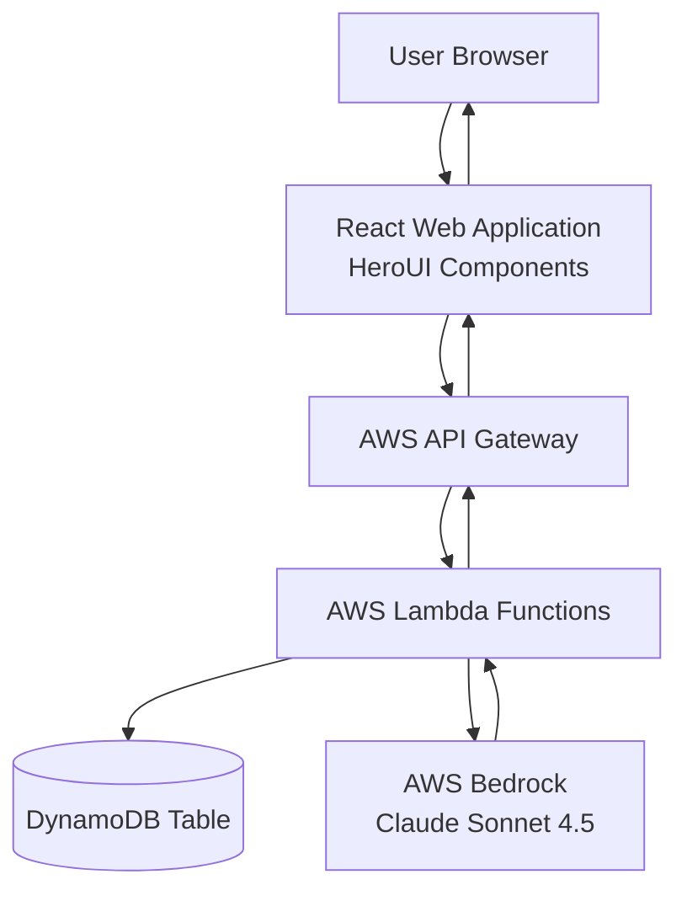

# Design Document: Token Usage Tracker

## Overview

The Token Usage Tracker is a full-stack web application that provides real-time monitoring and management of token consumption for users interacting with Claude Sonnet 4.5. The system architecture follows a serverless pattern using AWS services, with a React-based frontend, API Gateway for routing, Lambda functions for business logic, and DynamoDB for data persistence.

The system enables administrators to set token limits per user, tracks token consumption in real-time as users interact with the AI model, and enforces limits to prevent overages. Users can view their current usage, remaining tokens, and interact with Claude Sonnet 4.5 directly through the web interface.

## Architecture

### High-Level Architecture



### Component Layers

1. **Presentation Layer**: React application with HeroUI components
2. **API Layer**: AWS API Gateway with REST endpoints
3. **Business Logic Layer**: AWS Lambda functions
4. **Data Layer**: DynamoDB table for user data
5. **AI Model Layer**: AWS Bedrock with Claude Sonnet 4.5

### Data Flow

1. User interacts with the React web application
2. Web app sends HTTP requests to API Gateway
3. API Gateway routes requests to appropriate Lambda functions
4. Lambda functions process requests, interact with DynamoDB and/or Bedrock
5. Responses flow back through the same path to the user

## Components and Interfaces

### Frontend Components

#### 1. Dashboard Component
- **Purpose**: Main view displaying user token usage and limits
- **State**:
  - `userId`: Current user identifier
  - `tokenUsage`: Current token count consumed
  - `tokenLimit`: Maximum tokens allowed
  - `lastUpdated`: Timestamp of last usage update
- **Methods**:
  - `fetchUsageData()`: Retrieves current usage from API
  - `calculateRemaining()`: Computes remaining tokens
  - `calculatePercentage()`: Computes usage percentage
  - `refreshData()`: Polls API for updates every 5 seconds

#### 2. UserList Component
- **Purpose**: Administrative view of all users and their usage
- **State**:
  - `users`: Array of user objects with usage data
  - `sortBy`: Current sort field (usage, limit, percentage)
  - `selectedUser`: Currently selected user for details
- **Methods**:
  - `fetchAllUsers()`: Retrieves all users from API
  - `sortUsers(field)`: Sorts user list by specified field
  - `selectUser(userId)`: Displays detailed view for a user

#### 3. ModelInteraction Component
- **Purpose**: Interface for submitting prompts to Claude Sonnet 4.5
- **State**:
  - `prompt`: User input text
  - `response`: Model response text
  - `isLoading`: Request in progress indicator
  - `error`: Error message if request fails
- **Methods**:
  - `submitPrompt()`: Sends prompt to API
  - `handleResponse()`: Processes model response and updates usage display
  - `clearPrompt()`: Resets input field

#### 4. LimitManager Component
- **Purpose**: Administrative interface for managing user token limits
- **State**:
  - `userId`: User to modify
  - `newLimit`: New limit value
- **Methods**:
  - `updateLimit()`: Sends limit update to API
  - `validateLimit()`: Ensures limit is positive integer

### Backend Components

#### Lambda Functions

##### 1. GetUserUsage
- **Purpose**: Retrieves token usage and limit for a specific user
- **Input**: `{ userId: string }`
- **Output**: `{ userId: string, tokenUsage: number, tokenLimit: number, lastUpdated: string }`
- **Logic**:
  1. Validate userId parameter
  2. Query DynamoDB for user record
  3. Return user data or 404 if not found

##### 2. UpdateTokenLimit
- **Purpose**: Updates the token limit for a user
- **Input**: `{ userId: string, newLimit: number }`
- **Output**: `{ success: boolean, userId: string, tokenLimit: number }`
- **Logic**:
  1. Validate userId and newLimit parameters
  2. Ensure newLimit is positive integer
  3. Update DynamoDB record with new limit
  4. Return updated user data

##### 3. CreateUser
- **Purpose**: Creates a new user with initial token limit
- **Input**: `{ userId: string, tokenLimit: number }`
- **Output**: `{ success: boolean, userId: string, tokenLimit: number, tokenUsage: number }`
- **Logic**:
  1. Validate userId and tokenLimit parameters
  2. Check if user already exists
  3. Create DynamoDB record with tokenUsage = 0
  4. Return created user data

##### 4. RecordTokenUsage
- **Purpose**: Updates token usage after model interaction
- **Input**: `{ userId: string, tokensConsumed: number }`
- **Output**: `{ success: boolean, userId: string, tokenUsage: number, remainingTokens: number }`
- **Logic**:
  1. Validate userId and tokensConsumed parameters
  2. Use DynamoDB atomic increment to update tokenUsage
  3. Retrieve updated usage and limit
  4. Calculate remaining tokens
  5. Return updated usage data

##### 5. InvokeModel
- **Purpose**: Submits prompt to Claude Sonnet 4.5 and records token usage
- **Input**: `{ userId: string, prompt: string }`
- **Output**: `{ response: string, tokensConsumed: number, remainingTokens: number }`
- **Logic**:
  1. Validate userId and prompt parameters
  2. Check user's remaining tokens
  3. If remaining tokens <= 0, return error
  4. Invoke Bedrock API with Claude Sonnet 4.5 model
  5. Extract token count from response metadata
  6. Call RecordTokenUsage to update usage
  7. Return model response and updated usage data

##### 6. ListAllUsers
- **Purpose**: Retrieves all users with their usage data
- **Input**: None
- **Output**: `{ users: Array<{ userId: string, tokenUsage: number, tokenLimit: number, percentageUsed: number }> }`
- **Logic**:
  1. Scan DynamoDB table for all user records
  2. Calculate percentage used for each user
  3. Return array of user data

### API Endpoints

| Method | Endpoint | Lambda Function | Description |
|--------|----------|-----------------|-------------|
| GET | `/users/{userId}` | GetUserUsage | Get user usage and limit |
| PUT | `/users/{userId}/limit` | UpdateTokenLimit | Update user token limit |
| POST | `/users` | CreateUser | Create new user |
| POST | `/users/{userId}/usage` | RecordTokenUsage | Record token consumption |
| POST | `/invoke` | InvokeModel | Submit prompt to model |
| GET | `/users` | ListAllUsers | List all users |

## Data Models

### DynamoDB Table Schema

**Table Name**: `TokenUsageTable`

**Primary Key**: `userId` (String)

**Attributes**:
- `userId` (String): Unique user identifier
- `tokenLimit` (Number): Maximum tokens allowed
- `tokenUsage` (Number): Current cumulative token consumption
- `lastUpdated` (String): ISO 8601 timestamp of last update

**Example Record**:
```json
{
  "userId": "user-123",
  "tokenLimit": 100000,
  "tokenUsage": 45230,
  "lastUpdated": "2026-01-15T10:30:45.123Z"
}
```

### Frontend Data Models

#### User Interface Model
```typescript
interface User {
  userId: string;
  tokenLimit: number;
  tokenUsage: number;
  remainingTokens: number;
  percentageUsed: number;
  lastUpdated: string;
}
```

#### Model Response Interface
```typescript
interface ModelResponse {
  response: string;
  tokensConsumed: number;
  remainingTokens: number;
}
```

#### API Error Interface
```typescript
interface ApiError {
  error: string;
  message: string;
  statusCode: number;
}
```

## Correctness Properties

A property is a characteristic or behavior that should hold true across all valid executions of a system—essentially, a formal statement about what the system should do. Properties serve as the bridge between human-readable specifications and machine-verifiable correctness guarantees.

### Property 1: User Creation Initializes Correctly

*For any* valid user ID and positive token limit, creating a new user should result in a stored record with the specified limit and zero initial token usage.

**Validates: Requirements 1.1**

### Property 2: Token Limit Updates Persist

*For any* existing user and positive integer limit value, updating the user's token limit should result in the new limit being persisted and retrievable.

**Validates: Requirements 1.2**

### Property 3: User Data Round-Trip Consistency

*For any* user created with specific attributes (userId, tokenLimit, tokenUsage), retrieving that user should return all stored attributes with their correct values.

**Validates: Requirements 1.3, 8.4**

### Property 4: Invalid Limits Are Rejected

*For any* non-positive or non-integer token limit value (negative, zero, decimal, null), attempting to create or update a user with that limit should be rejected with an error.

**Validates: Requirements 1.4**

### Property 5: Token Usage Accumulates Correctly

*For any* user and sequence of token consumption amounts, recording each usage should result in the cumulative token usage equaling the sum of all recorded amounts.

**Validates: Requirements 2.2, 5.4**

### Property 6: Concurrent Updates Are Atomic

*For any* user and set of concurrent token usage updates, the final token usage should equal the initial usage plus the sum of all concurrent updates, with no updates lost.

**Validates: Requirements 2.3, 8.2**

### Property 7: Usage Updates Include Valid Timestamps

*For any* token usage update, the lastUpdated timestamp should be a valid ISO 8601 UTC timestamp within 10 seconds of the current time.

**Validates: Requirements 2.4**

### Property 8: Dashboard Displays Required User Data

*For any* user data (userId, tokenUsage, tokenLimit), the dashboard component should render all three values correctly in the UI.

**Validates: Requirements 3.1, 3.2, 4.2**

### Property 9: Remaining Tokens Calculated Correctly

*For any* token usage and token limit values where usage ≤ limit, the calculated remaining tokens should equal (limit - usage).

**Validates: Requirements 3.3**

### Property 10: Usage Percentage Calculated Correctly

*For any* token usage and positive token limit, the calculated percentage should equal (usage / limit) × 100, rounded to two decimal places.

**Validates: Requirements 3.5**

### Property 11: User List Contains All Users

*For any* set of users in the database, the user list component should display all users with no omissions or duplicates.

**Validates: Requirements 4.1**

### Property 12: User Sorting Works Correctly

*For any* list of users and sort field (usage, limit, or percentage), the sorted list should be ordered correctly by that field in ascending or descending order.

**Validates: Requirements 4.4**

### Property 13: User Selection Displays Correct Details

*For any* user selected from the user list, the detail view should display that specific user's information, not any other user's data.

**Validates: Requirements 4.3**

### Property 14: Token Count Extraction From Model Response

*For any* valid Claude Sonnet 4.5 response containing token metadata, the Lambda function should correctly extract the token count as a positive integer.

**Validates: Requirements 5.3**

### Property 15: Model Response and Usage Both Displayed

*For any* model response and updated usage data, the web application should display both the response text and the updated token usage information.

**Validates: Requirements 5.5**

### Property 16: Remaining Tokens Checked Before Model Invocation

*For any* user attempting to invoke the model, the system should retrieve and check their remaining tokens before forwarding the request to Claude Sonnet 4.5.

**Validates: Requirements 6.1**

### Property 17: API Responses Include Remaining Tokens

*For any* API response from token-related endpoints, the response should include a field indicating the user's remaining token count.

**Validates: Requirements 6.4**

### Property 18: Request Validation Rejects Invalid Formats

*For any* API endpoint and invalid request format (missing required fields, wrong data types, malformed JSON), the Lambda function should reject the request with a validation error before processing.

**Validates: Requirements 7.6**

### Property 19: Error Responses Include Descriptive Messages

*For any* error condition in the Lambda functions, the error response should include a descriptive message explaining what went wrong.

**Validates: Requirements 9.1**

### Property 20: Error Messages Displayed to Users

*For any* error response received by the web application, the error message should be displayed to the user in the UI.

**Validates: Requirements 9.2**

### Property 21: Loading States Shown During API Requests

*For any* API request initiated by the web application, a loading indicator should be displayed while the request is in progress and hidden when complete.

**Validates: Requirements 10.5**


## Error Handling

### Frontend Error Handling

**API Request Failures**:
- All API calls wrapped in try-catch blocks
- Network errors display user-friendly messages
- HTTP error codes mapped to specific error messages
- Error state stored in component state for display

**Error Display Strategy**:
- Toast notifications for transient errors (network issues)
- Inline error messages for form validation errors
- Modal dialogs for critical errors (limit exceeded, service unavailable)
- Error messages include actionable guidance when possible

**Error Recovery**:
- Retry mechanism for transient network failures (max 3 attempts)
- Automatic refresh of stale data after error recovery
- Clear error state when user takes corrective action

### Backend Error Handling

**Input Validation Errors**:
- Return HTTP 400 Bad Request
- Include specific validation failure details
- Example: `{ "error": "Invalid token limit", "message": "Token limit must be a positive integer", "statusCode": 400 }`

**Resource Not Found Errors**:
- Return HTTP 404 Not Found
- Include resource identifier in error message
- Example: `{ "error": "User not found", "message": "User with ID 'user-123' does not exist", "statusCode": 404 }`

**Authorization Errors**:
- Return HTTP 403 Forbidden
- Include reason for denial
- Example: `{ "error": "Token limit exceeded", "message": "User has consumed all allocated tokens", "statusCode": 403 }`

**Service Unavailability**:
- Return HTTP 503 Service Unavailable
- Indicate which service is unavailable (DynamoDB, Bedrock)
- Example: `{ "error": "Service unavailable", "message": "Database service is temporarily unavailable", "statusCode": 503 }`

**Internal Errors**:
- Return HTTP 500 Internal Server Error
- Log detailed error information for debugging
- Return generic message to user (don't expose internal details)
- Example: `{ "error": "Internal server error", "message": "An unexpected error occurred", "statusCode": 500 }`

### DynamoDB Error Handling

**Conditional Check Failures**:
- Occur when atomic operations fail due to concurrent modifications
- Retry operation with exponential backoff (max 3 retries)
- If retries exhausted, return HTTP 409 Conflict

**Throttling Errors**:
- Implement exponential backoff retry strategy
- Use DynamoDB auto-scaling to prevent throttling
- Return HTTP 429 Too Many Requests if retries exhausted

**Item Size Errors**:
- Validate data size before writing to DynamoDB
- Return HTTP 413 Payload Too Large if item exceeds limits

### Bedrock API Error Handling

**Model Invocation Failures**:
- Catch Bedrock API exceptions
- Map to appropriate HTTP status codes
- Return user-friendly error messages

**Throttling**:
- Implement retry with exponential backoff
- Return HTTP 429 if retries exhausted

**Invalid Prompts**:
- Validate prompt before sending to Bedrock
- Return HTTP 400 with validation details

## Testing Strategy

### Overview

The testing strategy employs a dual approach combining unit tests for specific examples and edge cases with property-based tests for universal correctness properties. This comprehensive approach ensures both concrete functionality and general correctness across all possible inputs.

### Property-Based Testing

**Framework**: We will use **fast-check** for TypeScript/JavaScript property-based testing.

**Configuration**:
- Minimum 100 iterations per property test
- Each test tagged with feature name and property number
- Tag format: `// Feature: token-usage-tracker, Property N: [property description]`

**Property Test Coverage**:
- Each correctness property from the design document implemented as a property-based test
- Tests generate random valid inputs to verify properties hold universally
- Focus on business logic and data transformations

**Example Property Test Structure**:
```typescript
// Feature: token-usage-tracker, Property 9: Remaining Tokens Calculated Correctly
test('remaining tokens equals limit minus usage', () => {
  fc.assert(
    fc.property(
      fc.integer({ min: 0, max: 1000000 }), // tokenUsage
      fc.integer({ min: 0, max: 1000000 }), // tokenLimit
      (usage, limit) => {
        fc.pre(usage <= limit); // precondition
        const remaining = calculateRemaining(usage, limit);
        return remaining === (limit - usage);
      }
    ),
    { numRuns: 100 }
  );
});
```

### Unit Testing

**Framework**: Jest for JavaScript/TypeScript unit testing

**Unit Test Focus**:
- Specific examples demonstrating correct behavior
- Edge cases (empty inputs, boundary values, zero/negative values)
- Error conditions and error message validation
- Integration points between components
- UI component rendering with specific props

**Backend Unit Tests**:
- Lambda function input validation
- DynamoDB query/update operations with mocked database
- Error response formatting
- Token count extraction from model responses
- Atomic increment operations

**Frontend Unit Tests**:
- Component rendering with various props
- User interaction handlers (button clicks, form submissions)
- API call integration with mocked fetch
- Error display logic
- Loading state transitions

### Integration Testing

**API Integration Tests**:
- End-to-end API flows from request to response
- Test with actual DynamoDB Local instance
- Mock Bedrock API calls to avoid costs
- Verify correct HTTP status codes and response formats

**Frontend Integration Tests**:
- User workflows (create user, submit prompt, view usage)
- Navigation between views
- API integration with mocked backend
- Error handling flows

### Test Organization

**Directory Structure**:
```
/src
  /lambda
    getUserUsage.ts
    getUserUsage.test.ts
    getUserUsage.properties.test.ts
  /components
    Dashboard.tsx
    Dashboard.test.tsx
    Dashboard.properties.test.tsx
```

**Naming Conventions**:
- Unit tests: `*.test.ts` or `*.test.tsx`
- Property tests: `*.properties.test.ts` or `*.properties.test.tsx`

### Test Data Management

**Generators for Property Tests**:
- User ID generator: random alphanumeric strings
- Token limit generator: positive integers (1 to 10,000,000)
- Token usage generator: non-negative integers (0 to limit)
- Timestamp generator: valid ISO 8601 UTC timestamps
- Prompt generator: random strings (1 to 10,000 characters)

**Mock Data for Unit Tests**:
- Predefined user objects with known values
- Sample model responses with token metadata
- Error response objects for each error type

### Continuous Integration

**Test Execution**:
- All tests run on every commit
- Property tests run with 100 iterations in CI
- Unit tests run with coverage reporting (target: 80% coverage)

**Test Failure Handling**:
- Property test failures include counterexample for debugging
- Failed tests block merge to main branch
- Flaky tests investigated and fixed immediately

### Manual Testing

**Exploratory Testing**:
- Test real-time updates by submitting multiple prompts
- Verify UI responsiveness on different screen sizes
- Test concurrent user interactions
- Validate error messages are clear and actionable

**Performance Testing**:
- Load test API endpoints with multiple concurrent requests
- Verify DynamoDB performance under load
- Test frontend performance with large user lists (1000+ users)
