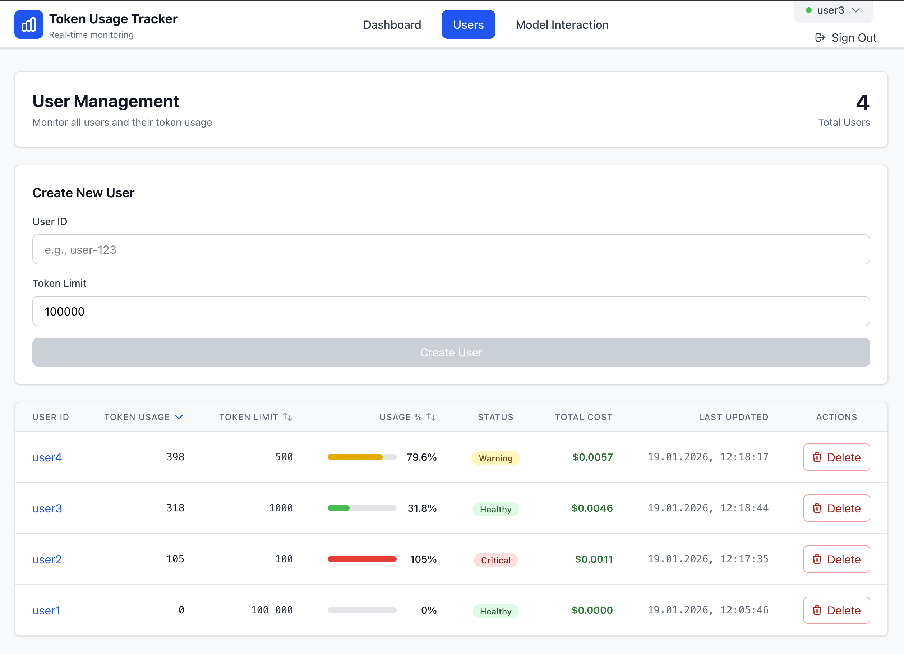
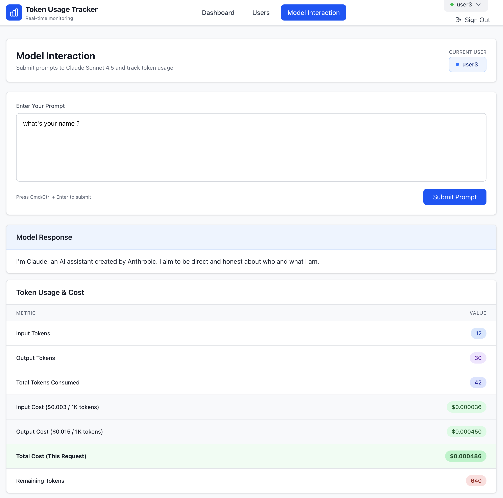
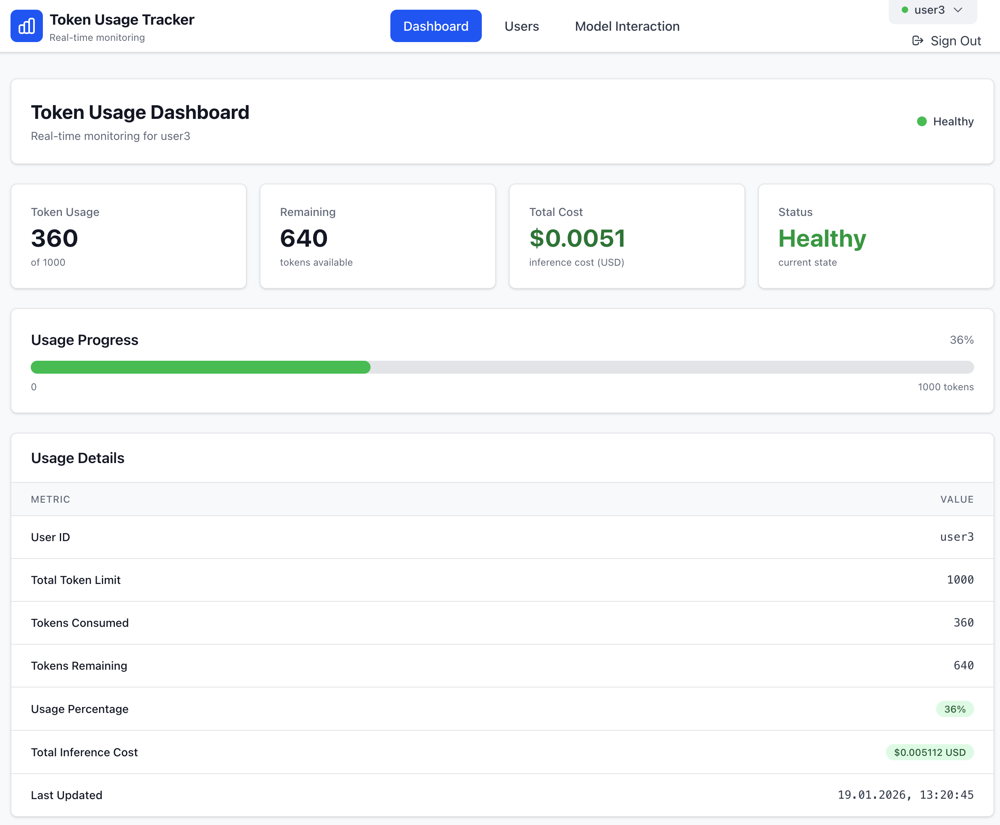
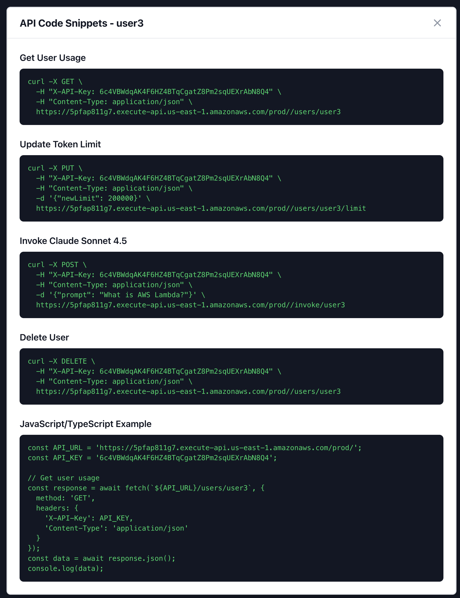
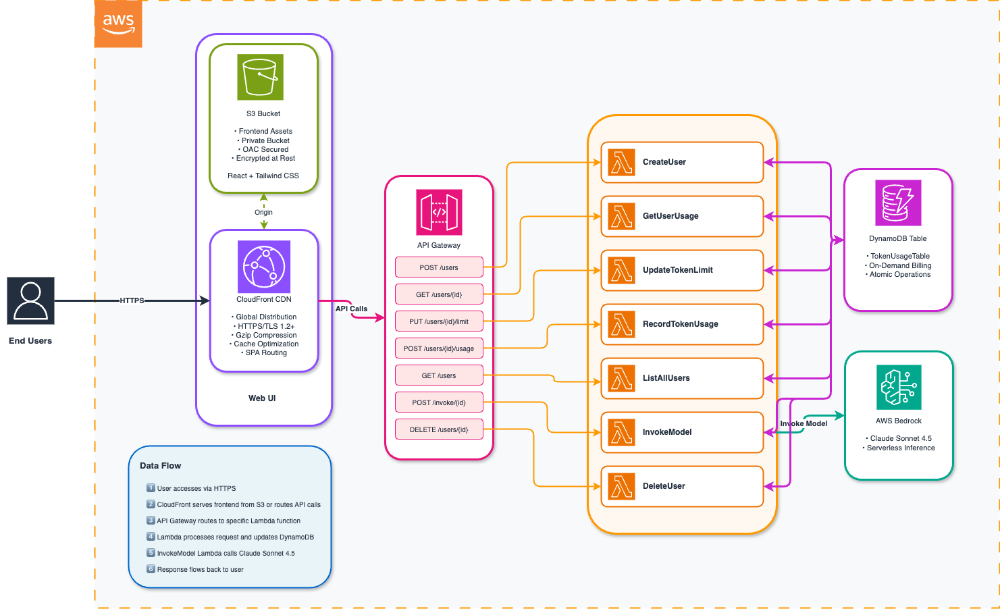

# Token Usage Tracker

A real-time token usage tracking system for monitoring and managing Claude Sonnet 4.5 token consumption.

DISCLAIMER: This is NOT a production code- use at your own risk

## Overview

This system provides real-time monitoring and management of token consumption for users interacting with Claude Sonnet 4.5. It consists of a React-based web application, serverless API backend using AWS Lambda, and DynamoDB for data persistence.

<div align="center">
  
  <p><em>Dashboard</em></p>
</div>

<div align="center">
  
    
  
  <p><em>| Model Interaction | Usage Analytic | API Syntax code|</em></p>
</div>

## Features

- **Cognito Authentication**: Secure user authentication with AWS Cognito User Pools
- **Real-time Token Tracking**: Monitor Claude Sonnet 4.5 token consumption with 5-second auto-refresh
- **Cost Calculation**: Automatic inference cost tracking based on AWS Bedrock pricing
- **User Management**: Create, update, delete users with customizable token limits
- **Interactive Model Interface**: Direct interaction with Claude Sonnet 4.5 with detailed cost breakdown
- **Administrative Dashboard**: Real-time usage analytics and reporting
- **Atomic Operations**: DynamoDB atomic increments prevent race conditions
- **Serverless Architecture**: Auto-scaling with pay-per-use pricing
- **Global CDN**: CloudFront distribution for fast worldwide access
- **Secure**: HTTPS/TLS encryption, private S3 buckets, IAM least-privilege, Cognito authentication
- **Modern UI**: Built with React 18, Tailwind CSS 4.0, and HeroUI components for a fast, responsive interface

## Architecture



## API Endpoints

### User Management

#### 1. Create User
**Endpoint**: `POST /users`  
**Lambda**: CreateUserFunction  
**Description**: Creates a new user with specified token limit  
**Request Body**:
```json
{
  "userId": "string",
  "tokenLimit": number
}
```
**Response** (201):
```json
{
  "success": true,
  "user": {
    "userId": "string",
    "tokenLimit": number,
    "tokenUsage": 0,
    "totalCost": 0,
    "lastUpdated": "ISO-8601 timestamp"
  }
}
```

#### 2. Get User Usage
**Endpoint**: `GET /users/{userId}`  
**Lambda**: GetUserUsageFunction  
**Description**: Retrieves token usage details for a specific user  
**Response** (200):
```json
{
  "userId": "string",
  "tokenLimit": number,
  "tokenUsage": number,
  "totalCost": number,
  "lastUpdated": "ISO-8601 timestamp"
}
```

#### 3. Update Token Limit
**Endpoint**: `PUT /users/{userId}/limit`  
**Lambda**: UpdateTokenLimitFunction  
**Description**: Updates the token limit for a user  
**Request Body**:
```json
{
  "newLimit": number
}
```
**Response** (200):
```json
{
  "userId": "string",
  "tokenLimit": number,
  "tokenUsage": number,
  "totalCost": number,
  "lastUpdated": "ISO-8601 timestamp"
}
```

#### 4. List All Users
**Endpoint**: `GET /users`  
**Lambda**: ListAllUsersFunction  
**Description**: Retrieves all users with their usage statistics  
**Response** (200):
```json
{
  "users": [
    {
      "userId": "string",
      "tokenLimit": number,
      "tokenUsage": number,
      "totalCost": number,
      "percentageUsed": number,
      "lastUpdated": "ISO-8601 timestamp"
    }
  ]
}
```

#### 5. Delete User
**Endpoint**: `DELETE /users/{userId}`  
**Lambda**: DeleteUserFunction  
**Description**: Deletes a user and all associated data  
**Response** (200):
```json
{
  "message": "User deleted successfully",
  "userId": "string"
}
```

### Token Usage

#### 6. Record Token Usage
**Endpoint**: `POST /users/{userId}/usage`  
**Lambda**: RecordTokenUsageFunction  
**Description**: Records token consumption for a user (atomic operation)  
**Request Body**:
```json
{
  "tokensConsumed": number
}
```
**Response** (200):
```json
{
  "userId": "string",
  "tokenLimit": number,
  "tokenUsage": number,
  "totalCost": number,
  "lastUpdated": "ISO-8601 timestamp"
}
```

### Model Interaction

#### 7. Invoke Model
**Endpoint**: `POST /invoke/{userId}`  
**Lambda**: InvokeModelFunction  
**Description**: Invokes Claude Sonnet 4.5 with a prompt and tracks token usage and cost  
**Request Body**:
```json
{
  "prompt": "string"
}
```
**Response** (200):
```json
{
  "response": "string",
  "tokensConsumed": number,
  "inputTokens": number,
  "outputTokens": number,
  "remainingTokens": number,
  "cost": {
    "inputCost": number,
    "outputCost": number,
    "totalCost": number
  }
}
```

## ✨ Quick Start

### Prerequisites

- Node.js 18+ and npm
- AWS CLI configured with credentials (`aws configure`)
- AWS CDK CLI installed (`npm install -g aws-cdk`)
- Sufficient AWS permissions (Lambda, API Gateway, DynamoDB, S3, CloudFront, Bedrock)

### 🚀 Automated Deployment (Recommended)

Deploy the entire stack with API key automatically configured:

```bash
# 1. Clone the repository
git clone <repository-url>
cd token-usage-tracker

# 2. Install all dependencies
npm run install:all

# 3. Deploy everything with one command
npm run deploy
```

**Expected output:**
```
✅ Deployment Complete!

━━━━━━━━━━━━━━━━━━━━━━━━━━━━━━━━━━━━━━━━━━━━━━━━━━━━━━━━━━━━
🌐 Application URL: https://xxxxx.cloudfront.net
🔗 API Gateway URL: https://xxxxx.execute-api.us-east-1.amazonaws.com/prod/
🔑 API Key: xxxxxxxxxxxxxxxxxxxxxxxxxxxxxxxx
━━━━━━━━━━━━━━━━━━━━━━━━━━━━━━━━━━━━━━━━━━━━━━━━━━━━━━━━━━━━

📝 Note: API key has been bundled into the deployed frontend
🔒 Security: .env.production has been removed from local filesystem
```

 Open the CloudFront URL provided in the deployment output, create an account, login and access the dashbpard !


### 🔧 Manual Deployment (Advanced)

If you prefer manual control or need to troubleshoot:

<details>
<summary>Click to expand manual deployment steps</summary>

```bash
# 1. Install dependencies
npm run install:all

# 2. Build and deploy backend
cd backend
npm run build
npx cdk deploy --outputs-file cdk-outputs.json

# 3. Extract API Key ID from outputs
API_KEY_ID=$(cat cdk-outputs.json | grep -o '"ApiKeyId": "[^"]*' | grep -o '[^"]*$')

# 4. Retrieve the actual API key value
API_KEY=$(aws apigateway get-api-key --api-key $API_KEY_ID --include-value --query 'value' --output text)

# 5. Get the API URL
API_URL=$(cat cdk-outputs.json | grep -o '"ApiUrl": "[^"]*' | grep -o '[^"]*$')

# 6. Configure frontend with API key
cd ../frontend
cat > .env.production << EOF
VITE_API_URL=$API_URL
VITE_API_KEY=$API_KEY
EOF

# 7. Build frontend with API key
npm run build

# 8. Redeploy to update frontend
cd ../backend
npx cdk deploy

# 9. Get your CloudFront URL
aws cloudformation describe-stacks \
  --stack-name TokenUsageTrackerStack \
  --query 'Stacks[0].Outputs[?OutputKey==`WebsiteUrl`].OutputValue' \
  --output text
```

</details>

### 💻 Local Development

For local development without AWS deployment:

```bash
# 1. Install dependencies
npm run install:all

# 2. Start mock API server (Terminal 1)
cd frontend
node mock-api-server.js

# 3. Start frontend dev server (Terminal 2)
cd frontend
npm run dev

# 4. Open browser
# Navigate to http://localhost:5173
```

### 🗑️ Destroying the Stack

To remove all AWS resources:

```bash
cd backend
npx cdk destroy

# If DynamoDB table persists (has retention policy):
aws dynamodb delete-table --table-name TokenUsageTable
```
## License

MIT

---

